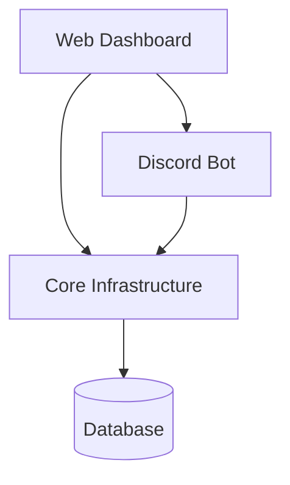

<p align="center">
  
</p>

<h1 align="center">Discord Community Bot</h1>

<p align="center">
A modular Discord bot with dashboard integration built with <b>Java, Spring Boot and JDA</b>.
</p>

<p align="center">
Role panels • Welcome system • Ticket system • Web dashboard • Multi-guild configuration
</p>

<p align="center">
  
  
  
  
  
</p>

---

# Overview

**Discord Community Bot** is a modular Discord bot designed for community servers.

The project combines:

* a Discord bot
* a web dashboard
* a persistent backend

The architecture separates Discord logic, dashboard functionality and shared infrastructure so the bot can easily be extended with additional modules.

---

# Screenshots

## Dashboard


## Ticket System

```
docs/screenshots/tickets.png
```

## Role Panels


---

# Features

## Community System

* Role panel with interactive buttons
* Welcome system for new members
* Persistent guild configuration
* Panel state tracking
* Reloadable panel configuration

## Ticket System

* Ticket creation via buttons or slash commands
* Ticket channel management
* Ticket persistence
* Guild-specific ticket configuration

## Web Dashboard

* Server configuration through a web interface
* Panel management
* Dashboard-triggered Discord actions
* Demo data for local development

## Core Infrastructure

* Security and authentication
* Permission handling
* Logging infrastructure
* Global configuration
* Shared persistence layer

---

# Architecture

The project is structured into multiple modules.

```
core
community
dashboard
ticket
```

## Architecture Diagram



This architecture allows the dashboard to control bot features while both share the same backend services.

---

# Modules

## Core

The **core module** contains shared infrastructure used by all parts of the system.

Responsibilities:

* security and authentication
* permission checks
* application configuration
* logging
* shared utilities
* dashboard user persistence

Example packages:

```
core.access
core.config
core.logging
core.persistence
core.security
core.util
core.web
```

---

## Dashboard

The **dashboard module** contains the web interface.

Responsibilities:

* HTTP controllers
* dashboard services
* DTOs
* demo data for development
* panel refresh functionality
* Discord access for dashboard actions

Example packages:

```
dashboard.controller
dashboard.dto
dashboard.demo
dashboard.panel
dashboard.service
dashboard.web
```

---

## Community

The **community module** contains the main Discord community features.

Responsibilities:

* guild configuration
* role panels
* welcome system
* Discord listeners
* persistence of community data

Example packages:

```
community.config
community.discord.listener
community.discord.commands
community.persistence
community.service
```

---

## Ticket Module

The **ticket module** provides a structured support system.

Responsibilities:

* ticket commands
* ticket button interactions
* ticket persistence
* guild-specific ticket settings

Example packages:

```
ticket.discord.commands
ticket.discord.listener
ticket.persistence
ticket.service
```

---

# Technology Stack

* Java
* Spring Boot
* JDA (Java Discord API)
* Gradle
* Spring Data / JPA
* REST Controllers for the dashboard

---

# Project Structure

```
src/main/java/de/tebrox/communitybot

core
community
dashboard
ticket
```

Main entry point:

```
CommunityBotApplication.java
```

---

# Configuration

Example configuration file:

```
config.yml.example
```

Typical configuration includes:

* Discord bot token
* database connection
* dashboard configuration
* guild specific settings

---

# Running the Project

## Requirements

* Java 17+
* Gradle

## Start in development

```bash
./gradlew bootRun
```

## Build

```bash
./gradlew build
```

---

# Deployment

The repository includes a system service example:

```
communitybot.service
```

This can be used to run the bot on Linux servers via **systemd**.

---

# Contributing

Contributions are welcome.

Typical workflow:

1. Fork the repository
2. Create a feature branch
3. Commit your changes
4. Open a pull request

Example:

```
git checkout -b feature/new-module
```

---

# Issue Templates

Example **bug report template**:

```markdown
## Bug description
Describe the issue clearly.

## Steps to reproduce
1. Do something
2. Click something
3. Error appears

## Expected behaviour
What should happen instead.

## Logs
Add relevant logs.
```

Example **feature request template**:

```markdown
## Feature description
Describe the feature.

## Problem
What problem does this solve?

## Proposed solution
How should the feature work?
```

---

# Future Modules

The modular architecture allows additional modules such as:

* moderation
* leveling
* automod
* statistics
* economy systems

---

# License


---

# Author

Tebrox
